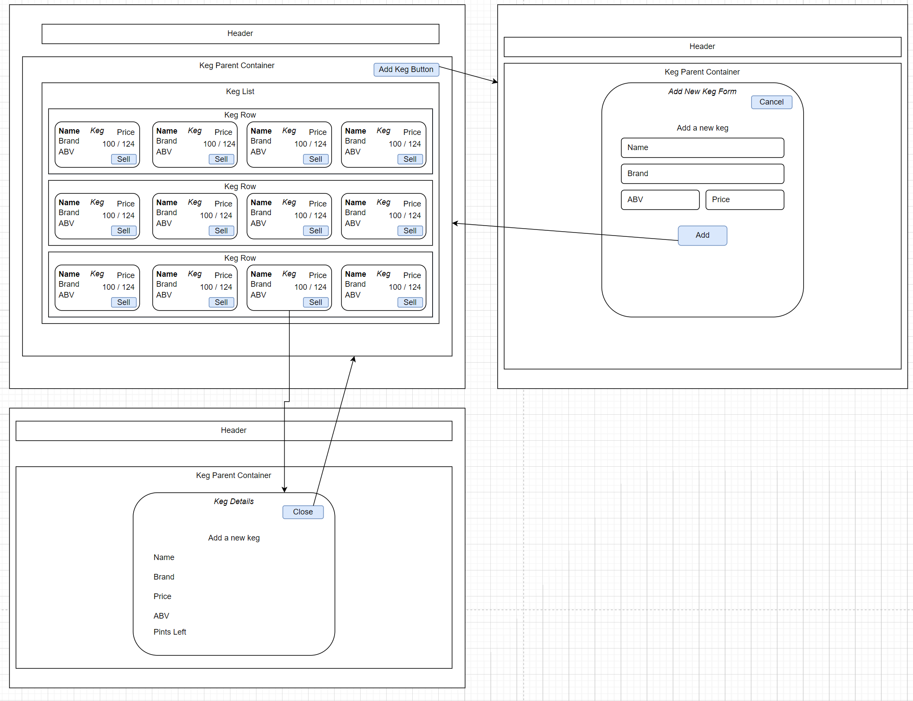

# _Tap Room_

#### By _Daniel Lindsey_

#### _React application for a brewery to manage kegs and pints_

## Technologies Used

- _React_
- _JSX_
- _HTML_
- _CSS_
- _Javascript_
- _Material UI_

## Description

This is a React web application for a brewery to manage keys and sell pints. Once run, the site will allow the owner to add kegs with some info, and sell pints from those kegs. The application is written in React and manages the kegs with state.

A site diagram is pictured below.

 

# Setup/Installation Requirements

## Cloning the repository

To view this application, you must clone it to your computer. To do so,

1. Locate and click the green Code button at the top of the [repository page](https://github.com/dlinds/tap-room), and choose the option to _Download ZIP_.
2. Once downloaded, navigate to your Downloads folder and extract the contents to a location of your choosing.

## Installing Packages with NPM

Once the project is downloaded to your computer, you will need to download the packages needed to run the application.

1. First, install Node.js

    [Node.js](https://nodejs.org/en/download/)
2. Once Node.js is installed, open up a terminal (Command Prompt on Windows, or Terminal on OSX)
3. Navigate to the project directory with the terminal, and enter the following command to install all of the necessary packages needed to run the application

    _npm install_

# Run the project
  Now that everything is installed and set up, you may run the project.

1. In the same terminal, or in a new terminal navigated to the projects directory, type the following command to run the application

    _npm start_

2. The application should auto open your browser to the home page of the application. If it does not, open a browser and navigate to http://localhost:3000

3. Should this step fail, please refer to the notes below on troubleshooting running a React application.
 

# Known Bugs

- _There are no known bugs at this time_

 

# License

_MIT_

Copyright (c) _4-22-2022_ _Daniel Lindsey_

 

# Troubleshooting a React App

This project was bootstrapped with [Create React App](https://github.com/facebook/create-react-app).

## Available Scripts

In the project directory, you can run:

### `npm start`

Runs the app in the development mode.\
Open [http://localhost:3000](http://localhost:3000) to view it in your browser.

The page will reload when you make changes.\
You may also see any lint errors in the console.

### `npm test`

Launches the test runner in the interactive watch mode.\
See the section about [running tests](https://facebook.github.io/create-react-app/docs/running-tests) for more information.

### `npm run build`

Builds the app for production to the `build` folder.\
It correctly bundles React in production mode and optimizes the build for the best performance.

The build is minified and the filenames include the hashes.\
Your app is ready to be deployed!

See the section about [deployment](https://facebook.github.io/create-react-app/docs/deployment) for more information.

### `npm run eject`

**Note: this is a one-way operation. Once you `eject`, you can't go back!**

If you aren't satisfied with the build tool and configuration choices, you can `eject` at any time. This command will remove the single build dependency from your project.

Instead, it will copy all the configuration files and the transitive dependencies (webpack, Babel, ESLint, etc) right into your project so you have full control over them. All of the commands except `eject` will still work, but they will point to the copied scripts so you can tweak them. At this point you're on your own.

You don't have to ever use `eject`. The curated feature set is suitable for small and middle deployments, and you shouldn't feel obligated to use this feature. However we understand that this tool wouldn't be useful if you couldn't customize it when you are ready for it.

## Learn More

You can learn more in the [Create React App documentation](https://facebook.github.io/create-react-app/docs/getting-started).

To learn React, check out the [React documentation](https://reactjs.org/).

### Code Splitting

This section has moved here: [https://facebook.github.io/create-react-app/docs/code-splitting](https://facebook.github.io/create-react-app/docs/code-splitting)

### Analyzing the Bundle Size

This section has moved here: [https://facebook.github.io/create-react-app/docs/analyzing-the-bundle-size](https://facebook.github.io/create-react-app/docs/analyzing-the-bundle-size)

### Making a Progressive Web App

This section has moved here: [https://facebook.github.io/create-react-app/docs/making-a-progressive-web-app](https://facebook.github.io/create-react-app/docs/making-a-progressive-web-app)

### Advanced Configuration

This section has moved here: [https://facebook.github.io/create-react-app/docs/advanced-configuration](https://facebook.github.io/create-react-app/docs/advanced-configuration)

### Deployment

This section has moved here: [https://facebook.github.io/create-react-app/docs/deployment](https://facebook.github.io/create-react-app/docs/deployment)

### `npm run build` fails to minify

This section has moved here: [https://facebook.github.io/create-react-app/docs/troubleshooting#npm-run-build-fails-to-minify](https://facebook.github.io/create-react-app/docs/troubleshooting#npm-run-build-fails-to-minify)
